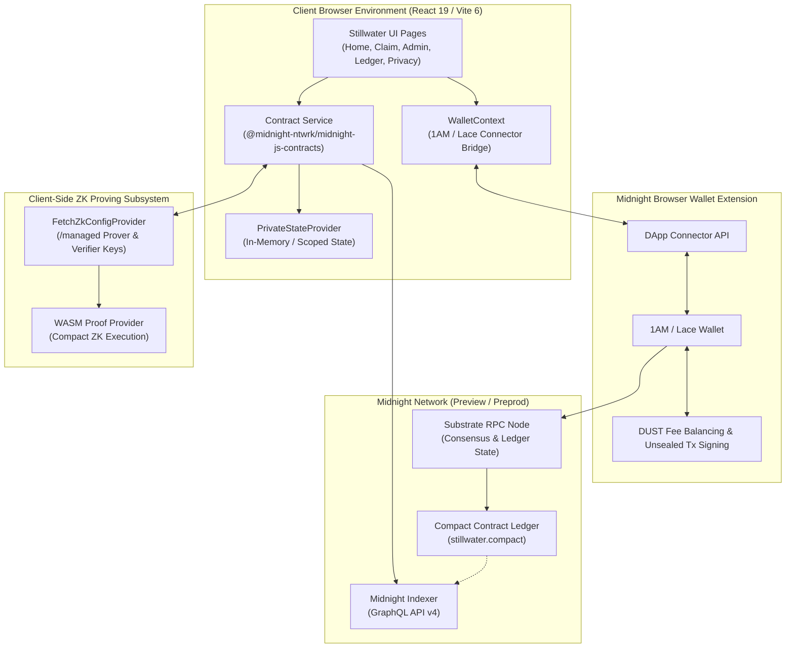
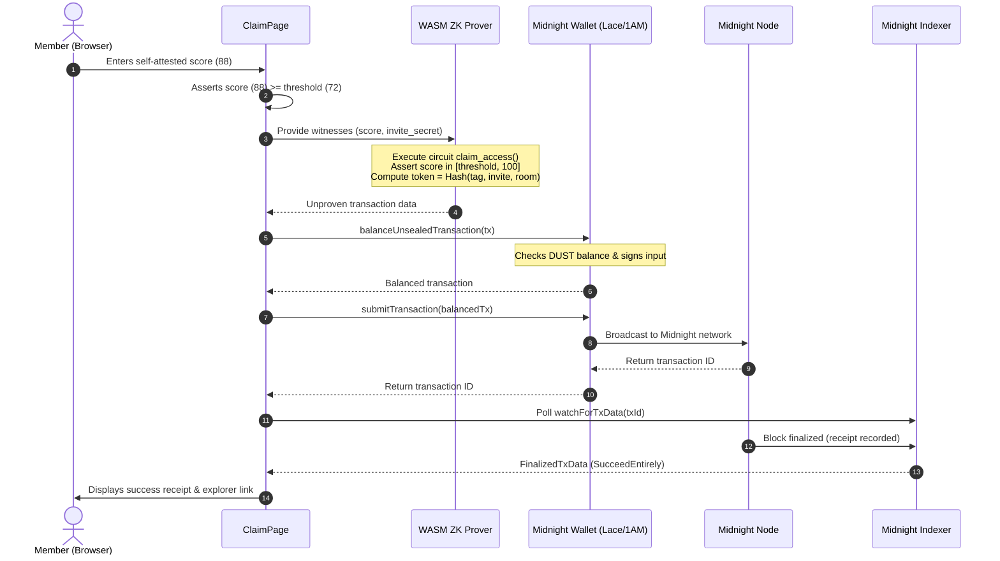

# Stillwater

> Private allowlist access and selective disclosure on Midnight Network.

[](https://github.com/Aryaaaaaa21/StillWater/actions/workflows/ci.yaml)
[](https://still-water-zeta.vercel.app/)
[](LICENSE)
[](https://midnight.network)
[](https://docs.midnight.network)
[](https://react.dev)
[](https://www.typescriptlang.org)
[](src/test/stillwater.test.ts)

[Overview](#overview) • [Live App](https://still-water-zeta.vercel.app/) • [Live Preprod Evidence](#live-on-chain-deployment--evidence) • [Why Stillwater](#why-stillwater) • [Architecture](#architecture) • [Product Walkthrough](#product-walkthrough) • [Getting Started](#getting-started) • [Circuit Reference](#contract--circuit-reference) • [Privacy Model](#privacy-model--trust-boundary) • [Verification](#verification-checklist)

---

<p align="center">
  
</p>

```text
┌────────────────┬────────────────────────────────────────────────────────┐
│ stillwater.    │ Workspace / Overview               [Preview ▾] [Connect]│
│                ├────────────────────────────────────────────────────────┤
│ • Overview     │ Welcome                                                │
│ • Your access  │ ┌──────── Stillwater Alpine Lake / Introduction ─────┐ │
│ • Public ledger│ │ Belong here. Leave less behind.                    │ │
│                │ └────────────────────────────────────────────────────┘ │
│ ⚙ Tools        │  Public Threshold   Access Receipts   Private Witnesses│
│ • Operator     │        72 / 100       12 / 144               3         │
│ • Privacy      │ ┌──────────────────────┐   ┌─────────────────────────┐ │
│                │ │ Current Active Space │   │ Designed to Disclose    │ │
│ ☼ Day / ☾ Night│ │ One rule. Open door. │   │ Less: Score is private. │ │
│ ⚿ Midnight v1.0│ └──────────────────────┘   └─────────────────────────┘ │
└────────────────┴────────────────────────────────────────────────────────┘
```

---

## Live On-Chain Deployment & Evidence

Stillwater is deployed, tested, and verified on the **Midnight Preprod Network**:

| Evidence Parameter | On-Chain Value / Direct Link |
|---|---|
| **Live Production App** | [https://still-water-zeta.vercel.app/](https://still-water-zeta.vercel.app/) |
| **Network** | `Midnight Preprod` |
| **Contract Address** | [`a791f2a7397ae3294d530e9bc6186d45175b2f362371ae87f54f4bd3ed368b2a`](https://explorer.1am.xyz/contract/a791f2a7397ae3294d530e9bc6186d45175b2f362371ae87f54f4bd3ed368b2a) |
| **Deployment Transaction** | [`25a637c4d99a5f239dec314a5ac7b54748328a4ee98c02472cf1c3fc573749e0`](https://explorer.1am.xyz/tx/25a637c4d99a5f239dec314a5ac7b54748328a4ee98c02472cf1c3fc573749e0?network=preprod) |
| **Transaction Hash** | `6596562024d9d0efaa6de5b4a3bb0a3b10eaf2b658b83cd4b94a13baa7d7762f` / [`3f441d45...`](https://explorer.1am.xyz/tx/3f441d45ebefbd5dc33841ebd4b2821a818ca2e75263fdcfb49298557fc94897?network=preprod) |
| **1AM Block Explorer** | [https://explorer.1am.xyz/contract/a791f2a7397ae3294d530e9bc6186d45175b2f362371ae87f54f4bd3ed368b2a](https://explorer.1am.xyz/contract/a791f2a7397ae3294d530e9bc6186d45175b2f362371ae87f54f4bd3ed368b2a) |

---

## Contents

- [Overview](#overview)
  - [The Problem](#the-problem)
  - [The Approach](#the-approach)
  - [The Result](#the-result)
- [Live On-Chain Deployment & Evidence](#live-on-chain-deployment--evidence)
- [Why Stillwater](#why-stillwater)
- [Core Features](#core-features)
- [Product Story](#product-story)
- [Product Walkthrough](#product-walkthrough)
  - [01. Workspace Overview (`/`)](#01-workspace-overview-)
  - [02. Private Member Claim Flow (`/claim`)](#02-private-member-claim-flow-claim)
  - [03. Operator Studio & Room Management (`/admin`)](#03-operator-studio--room-management-admin)
  - [04. Public Ledger State Explorer (`/ledger`)](#04-public-ledger-state-explorer-ledger)
  - [05. Privacy Model & Boundary Analysis (`/privacy`)](#05-privacy-model--boundary-analysis-privacy)
- [Architecture](#architecture)
  - [System Architecture Diagram](#system-architecture-diagram)
  - [Layer Responsibilities](#layer-responsibilities)
  - [Data Flow & Zero-Knowledge Claim Lifecycle](#data-flow--zero-knowledge-claim-lifecycle)
- [Contract & Circuit Reference](#contract--circuit-reference)
  - [Ledger State Variables](#ledger-state-variables)
  - [Circuit Interface](#circuit-interface)
  - [Witness Callbacks](#witness-callbacks)
- [Technology Stack](#technology-stack)
- [Project Structure](#project-structure)
- [Privacy Model & Trust Boundary](#privacy-model--trust-boundary)
  - [Public vs. Private Ledger Surface](#public-vs-private-ledger-surface)
  - [Observer Model](#observer-model)
- [Getting Started](#getting-started)
  - [Prerequisites](#prerequisites)
  - [Installation](#installation)
  - [Environment Variables](#environment-variables)
  - [Run Locally](#run-locally)
- [Testing](#testing)
- [Build & Compilation](#build--compilation)
- [Deployment](#deployment)
  - [Browser Deployment via Operator Studio](#browser-deployment-via-operator-studio)
  - [Hosting Platforms](#hosting-platforms)
- [Design System](#design-system)
- [Security Considerations](#security-considerations)
- [Known Limitations](#known-limitations)
- [Project Status & Roadmap](#project-status--roadmap)
- [Verification Checklist](#verification-checklist)
- [Contributing](#contributing)
- [License](#license)
- [Acknowledgements](#acknowledgements)

---

## Overview

**Stillwater** is a zero-knowledge decentralized application (dApp) built on the **Midnight Network** for **private allowlist access and selective disclosure**. An operator establishes access policies (minimum score threshold, room capacity, and expiration block time), and a visitor cryptographically proves their private score satisfies the condition inside a client-side zero-knowledge proof circuit.

The Midnight blockchain records only the public room policy and an anonymous, room-scoped redemption receipt. **The visitor's raw score, private invite secret, and operator key never appear on the public ledger.**

### The Problem

Communities, research collectives, confidential beta tests, and private event organizers frequently need to enforce admission rules:
1. Conventional web applications require members to submit raw credentials, personal identities, or credit metrics to centralized databases, creating honeypots for data leaks.
2. Public blockchain allowlists (e.g., standard ERC-20/NFT or whitelist trees) record wallet addresses directly on-chain, permanently exposing an individual's affiliations, transaction frequency, and association graph.
3. Traditional authorization frameworks force an all-or-nothing trade-off: either surrender complete privacy to access a space, or forfeit verifiability.

### The Approach

Stillwater leverages Midnight's dual-state execution model and the Compact programming language:
- **Private Witnesses:** The claimant's score ($s \in [0, 100]$) and local high-entropy invite secret are passed as private witnesses into the client ZK prover.
- **Circuit Verification:** The Compact circuit deterministically asserts $s \ge \text{threshold}$, checks that the room is unlocked, confirms capacity has not been exhausted, and derives a cryptographic nullifier:
  $$\text{token} = \mathcal{H}_{\text{persistent}}\left(\text{"stillwater:redeem:r1"}, \text{invite}, \text{room\_id}\right)$$
- **Selective Disclosure:** Only the room-scoped token and the incremented aggregate count are disclosed (`disclose()`) to the consensus layer. Replays of the same secret within the same room are prevented, but no observer can deduce which score or original secret generated the token.

### The Result

A quiet, lightweight access primitive where operators can verify that valid visitors have been admitted without maintaining a surveillance registry of who they are or how highly they scored.

---

## Why Stillwater

| Feature / Property | Standard Public Allowlist | Centralized Auth (OAuth / DB) | Stillwater (Midnight dApp) |
|---|---|---|---|
| **Claimant Identity** | Public wallet address exposed on-chain | PII stored in centralized database | **Anonymous**; no identity or wallet tied to claim |
| **Score / Credential Privacy** | Plaintext on-chain or off-chain database | Transmitted to & stored by server | **Zero-Knowledge**; score never leaves client device |
| **Verifiability** | Fully public | Private to service owner | **Publicly verifiable** on Midnight ledger |
| **Replay Protection** | Public address mapping | Database unique constraints | **Nullifier token** scoped per room domain |
| **Operator Access Control** | Admin keys exposed | Centralized superadmin | **ZK proof of operator secret** commitment |
| **Data Footprint** | Bloated account maps | Vulnerable user tables | **Minimal** aggregate counters & nullifier sets |

---

## Core Features

### Operator Studio (`/admin`)
- **Direct Browser Deployment:** Deploys fresh Stillwater access contracts directly from the browser using compiled ZK assets and the connected Midnight wallet.
- **Configurable Access Policies:** Adjust threshold score ($0–100$), capacity ($1–\infty$), and expiration timestamps.
- **Commitment-Based Admin Auth:** The operator retains a 32-byte secret in memory/session. Only a domain-separated cryptographic commitment ($\text{Hash}(\text{"stillwater:operator:r1"}, \text{secret})$) is published on-chain.
- **Lifecycle Management:** One-click lock and unlock circuits (`lock_room`, `unlock_room`) and clean room rotation (`rotate_room`) with state counter resets.

### Member Claim Portal (`/claim`)
- **Zero-Knowledge Proof Generation:** Executes Compact ZK circuits locally in browser WebAssembly using Midnight's proving provider.
- **Local Identity Isolation:** High-entropy local invite secret generated and kept in memory (`localStorage` key masked).
- **Instant Pre-Validation:** Real-time feedback verifying that the active score clears the published threshold before initiating the ZK proving pipeline.
- **Replay State Awareness:** Automatically checks on-chain indexed receipts to notify the user if an access token has already been spent in the current room.

### Public Ledger Explorer (`/ledger`)
- **Transparent Policy Inspection:** Real-time GraphQL subscription to public ledger state: threshold, active capacity, room fingerprint, expiry, and room state.
- **Real-Time Receipt Feed:** Live display of anonymous receipts (`redeemed_tokens`) without revealing claimant metadata.
- **Capacity Gauge:** Visual percentage meter tracking remaining available claims.

### Privacy Model & Trust Boundary (`/privacy`)
- **Honest Trust Disclosure:** Explicit, plain-language documentation of what observers can see versus what the circuit protects.
- **Code-Level Transparency:** In-browser inspection of the exact Compact `disclose()` boundary and derivation math.
- **MVP Guardrails:** Upfront documentation that self-attestation is for selective disclosure research and not Sybil-resistant identity.

---

## Product Story

```text
[Operator]                                              [Claimant]
    │                                                        │
    ▼                                                        │
1. Generates 32-byte Operator Secret                         │
2. Publishes Policy (Threshold=72, Limit=144)                │
3. Deploys Contract via Midnight Wallet                      │
    │                                                        │
    ├─────────────► [Midnight Public Ledger] ◄───────────────┤
    │               • Room ID: 0x8f2a...                     │
    │               • Threshold: 72                          │
    │               • Claims: 0 / 144                        │
    │               • Operator Commitment                    │
    │                                                        │
    │                                                        ▼
    │                                           4. Enters Private Score (e.g., 88)
    │                                           5. Circuit verifies: 88 >= 72
    │                                           6. Generates Local ZK Proof
    │                                           7. Submits Anonymous Receipt Token
    ▼                                                        ▼
[Public Observers / Operator]
• Can verify: A qualified claimant redeemed 1 slot
• Cannot see: Score 88, Claimant Secret, or Claimant Address
• Ledger updates: Claims: 1 / 144, Token 0x3d4e... inserted
```

---

## Product Walkthrough

### 01. Workspace Overview (`/`)

The workspace home pairs a restrained editorial palette with natural imagery (`stillwater-lake.jpg`). It exposes summary metric cards directly bound to the on-chain indexer, displaying the current public threshold, total claims accepted, and active room status.

```text
┌────────────────────────────────────────────────────────────────────────┐
│  Public threshold           Access receipts          Private witnesses │
│  72 / 100                   12 of 144 places         3 (Never on ledger│
└────────────────────────────────────────────────────────────────────────┘
```

### 02. Private Member Claim Flow (`/claim`)

Claimants review the space's published criteria alongside their local self-attested score. When the user clicks **Generate private proof**, the browser compiles the private witnesses (`get_private_score` and `get_invite_secret`), constructs the circuit execution trace, generates the zero-knowledge proof, balances the transaction with DUST from the connected wallet, and submits the unsealed transaction.

```text
[ Private Score Input: 88 ]  ───►  [ Circuit Assertion: 88 >= 72 ✓ ]
[ Invite Secret: 0x9a4f... ]  ───►  [ Derive Token: 0x3b1c...       ]
                                    [ Check Unspent: !member(Token)✓ ]
                                                    │
                                                    ▼
                                    [ Submit Proof + Disclose Token ]
```

### 03. Operator Studio & Room Management (`/admin`)

Operators deploy new rooms or manage active contracts. The operator secret is generated with `crypto.getRandomValues(32)` and can be toggled visible/masked. The deployment flow automatically formats the constructor parameters:
```typescript
args: [threshold, room, expiry, issuer, commitment, capacity]
```
Once deployed, the operator can toggle space availability with atomic `lock_room()` and `unlock_room()` calls.

### 04. Public Ledger State Explorer (`/ledger`)

A dedicated dashboard tracking the public contract state via the Midnight indexer. Displays the raw contract identifier, capacity utilization bar, closing timestamp, and an append-only feed of one-time cryptographic receipts.

### 05. Privacy Model & Boundary Analysis (`/privacy`)

An educational, transparent breakdown of the cryptography. It details the observer model: observers see transaction timestamps, block heights, and redemption tokens, but are mathematically barred from learning witness inputs.

---

## Architecture

### System Architecture Diagram



### Layer Responsibilities

1. **Smart Contract Layer (`contracts/`):**
   Written in Compact (`stillwater.compact`). Defines state transitions, access assertions, operator authorization checks, and redemption token insertion.
2. **Managed Circuit Layer (`contracts/managed/` & `frontend/public/managed/`):**
   Pre-compiled ZK artifacts including prover keys (`.prover`), verifier keys (`.verifier`), ZK Intermediate Representation (`.zkir`, `.bzkir`), and TypeScript contract wrappers.
3. **Provider Seam Layer (`frontend/src/lib/midnight.ts`):**
   Constructs `SessionProviders` conforming to Midnight JS SDK specifications: `PrivateStateProvider`, `FetchZkConfigProvider`, `indexerPublicDataProvider`, and wallet adapters.
4. **Application Logic Layer (`frontend/src/lib/contract.ts`):**
   Handles unproven transaction creation (`createUnprovenDeployTx`, `createUnprovenCallTx`), status progress telemetry (`validating` $\to$ `proving` $\to$ `balancing` $\to$ `submitting` $\to$ `confirming`), and indexer receipt polling.
5. **Presentation Layer (`frontend/src/`):**
   React 19 single-page application with modular routing (`react-router-dom`), custom hooks (`useContractState`, `useDeployment`), and nature-inspired CSS design tokens.

### Data Flow & Zero-Knowledge Claim Lifecycle



---

## Contract & Circuit Reference

Located in [`contracts/stillwater.compact`](contracts/stillwater.compact):

```compact
pragma language_version >=0.23.0;
import CompactStandardLibrary;
```

### Ledger State Variables

| Variable | Type | Visibility | Description |
|---|---|---|---|
| `claim_threshold` | `Uint<64>` | Public (`export ledger`) | Minimum score required to claim access ($0–100$). |
| `room_id` | `Bytes<32>` | Public (`export ledger`) | 32-byte domain separator identifying the active space. |
| `claim_expiry` | `Uint<64>` | Public (`export ledger`) | Unix block timestamp deadline for valid claims. |
| `issuer_id` | `Bytes<32>` | Public (`export ledger`) | Identifier slot for future credential issuer verification. |
| `operator_commitment` | `Bytes<32>` | Public (`export ledger`) | $\mathcal{H}(\text{"stillwater:operator:r1"}, \text{operator\_secret})$. |
| `room_open` | `Boolean` | Public (`export ledger`) | Emergency pause switch (`true` = open, `false` = locked). |
| `claims` | `Counter` | Public (`export ledger`) | Monotonically increasing count of accepted room claims. |
| `claim_limit` | `Uint<32>` | Public (`export ledger`) | Maximum number of allowed admissions for the room. |
| `redeemed_tokens` | `Set<Bytes<32>>` | Public (`export ledger`) | Cryptographic set of derived redemption tokens (prevents replay). |
| `claim_receipts` | `Map<Bytes<32>, Bytes<32>>` | Public (`export ledger`) | Mapping of $\text{token} \mapsto \text{room\_id}$. |
| `release` | `Bytes<32>` | Public Sealed (`export sealed`) | Sealed release version tag (`"stillwater:release:r1"`). |
| `room_history` | `Set<Bytes<32>>` | Unexported (`ledger`) | Historical set of all prior room IDs to prevent rotation reuse. |

### Circuit Interface

#### `constructor(threshold, room, expiry, issuer, operator_hash, limit)`
Initializes the space, sets `room_open = true`, inserts `room` into `room_history`, and validates that threshold is $\le 100$ and limit is positive.

#### `claim_access(): []`
The primary zero-knowledge entrypoint:
1. Asserts `room_open == true`.
2. Asserts `blockTimeLt(claim_expiry)`.
3. Asserts `claims < claim_limit`.
4. Reads private witness `score = get_private_score()`.
5. Asserts $0 \le \text{score} \le 100$ and $\text{score} \ge \text{claim\_threshold}$.
6. Reads private witness `invite = get_invite_secret()`.
7. Computes `token = derive_redemption_token(invite, room_id)`.
8. Asserts `!redeemed_tokens.member(token)`.
9. Inserts `token` into `redeemed_tokens` and `claim_receipts`.
10. Increments `claims` counter by 1.

#### `rotate_room(new_threshold, new_room, new_expiry, new_issuer, new_limit): []`
Operator-restricted circuit:
1. Reads `operator_secret()` witness and verifies commitment match.
2. Asserts `!room_history.member(new_room)`.
3. Resets `claims` counter to default.
4. Updates policy parameters and opens the new room.

#### `lock_room(): []` and `unlock_room(): []`
Operator-restricted circuit to pause or unpause claim submissions.

### Witness Callbacks

```compact
witness get_private_score(): Uint<64>;
witness get_invite_secret(): Bytes<32>;
witness operator_secret(): Bytes<32>;
```

---

## Technology Stack

| Layer | Technology | Version | Purpose in Stillwater |
|---|---|---|---|
| **Zero-Knowledge Core** | Midnight Compact | $\ge 0.23.0$ | Privacy-preserving smart contract language |
| **SDK & Types** | `@midnight-ntwrk/compact-js` | `2.5.1` | JavaScript bindings for compiled Compact contracts |
| **Runtime** | `@midnight-ntwrk/compact-runtime` | `0.16.0` | In-circuit execution and signing key sampling |
| **Contract Client** | `@midnight-ntwrk/midnight-js-contracts` | `4.1.1` | Transaction creation (`createUnprovenDeployTx`, `createUnprovenCallTx`) |
| **Wallet Connector** | `@midnight-ntwrk/dapp-connector-api` | `4.0.1` | Standard interface for Midnight browser extension wallets |
| **Ledger Data** | `@midnight-ntwrk/ledger-v8` | `8.1.0` | Ledger transaction deserialization and balancing |
| **Public Data** | `@midnight-ntwrk/midnight-js-indexer-public-data-provider` | `4.1.1` | Indexer GraphQL queries and transaction confirmation watcher |
| **Frontend Framework** | React | `19.0.0` | UI component tree and rendering |
| **Build Tooling** | Vite | `6.0.0` | ESM bundler, dev server, and asset optimization |
| **Language** | TypeScript | `5.7.3` | End-to-end static type safety |
| **Testing** | Vitest | `4.1.0` | Fast deterministic Compact contract test runner |
| **Styling** | Vanilla CSS3 Tokens | — | Custom nature design system with day/night modes |
| **Icons** | Lucide React | `0.468.0` | Lightweight accessible icon set |
| **Local Environment** | Docker Compose | `compose.yml` | Local Midnight node, proof server, and indexer stack |

---

## Project Structure

```text
stillwater/
├── .github/
│   └── workflows/
│       ├── ci.yaml                    # Automated lint, compile, test, typecheck, and build CI
│       └── deploy.yaml                # Release build & deployment pipeline
├── contracts/
│   ├── compiler.json                  # Compact compiler configuration and compiler options
│   ├── index.ts                       # TypeScript export index for contract artifacts
│   ├── stillwater.compact             # Master Compact smart contract source
│   └── managed/                       # Compiled ZK circuit artifacts and TypeScript wrappers
│       └── stillwater/
│           ├── compiler/              # Compact compiler metadata
│           ├── contract/              # Generated TypeScript contract classes & pure circuits
│           ├── keys/                  # Prover (.prover) and verifier (.verifier) key material
│           ├── zkir/                  # Zero-Knowledge Intermediate Representation (.zkir, .bzkir)
│           └── manifest.json          # Artifact manifest and key verification hashes
├── docs/
│   └── DESIGN.md                      # Complete UI/UX specification, tokens, and interaction rules
├── frontend/
│   ├── index.html                     # HTML5 application shell with metadata & favicon
│   ├── package.json                   # Frontend dependencies (React 19, Vite 6, Midnight JS)
│   ├── tsconfig.json                  # Frontend TypeScript compiler configuration
│   ├── vite.config.ts                 # Vite config with WASM and Top-Level Await plugins
│   ├── .env.example                   # Client environment variable template
│   ├── public/
│   │   ├── _headers                   # Security headers for Netlify/static hosting
│   │   ├── _redirects                 # SPA routing redirect rule
│   │   ├── favicon.svg                # Brand wave icon
│   │   ├── fonts/                     # Self-hosted DM Sans & DM Serif Display typefaces
│   │   ├── images/                    # Local photography assets (lake, forest, summit)
│   │   └── managed/                   # Browser-served ZK keys and circuit assets
│   └── src/
│       ├── App.tsx                    # Shell layout, navigation sidebar, theme provider
│       ├── config.ts                  # Network configuration, explorer URLs, address storage
│       ├── index.css                  # Design system CSS variables and component styling
│       ├── main.tsx                   # React root mount point
│       ├── polyfills.ts               # Browser Buffer and global polyfills
│       ├── components/                # Reusable UI components & transaction toast feedback
│       ├── contexts/                  # WalletContext managing 1AM/Lace extension lifecycle
│       ├── hooks/                     # Custom hooks (useContractState, useDeployment)
│       ├── lib/                       # Midnight SDK helpers, wallet detection, and validation
│       └── pages/                     # Routed pages (Home, Claim, Admin, Ledger, Privacy)
├── scripts/
│   ├── compile-contract.mjs           # Script compiling stillwater.compact via compactc
│   ├── sync-managed.mjs               # Synchronizes managed assets across root & frontend
│   ├── copy-build.mjs                 # Copies production frontend bundle to root dist/
│   ├── wait-for-dust.ts               # Preprod utility to await wallet DUST fee readiness
│   └── inspect-preprod.mjs            # CLI utility inspecting deployed state on Preprod
├── src/
│   ├── config.ts                      # Backend / Node network provider definitions
│   ├── providers.ts                   # Midnight JS provider initialization
│   └── test/
│       └── stillwater.test.ts         # 18 comprehensive deterministic contract unit tests
├── compose.yml                        # Docker Compose configuration for local devnet
├── netlify.toml                       # Netlify deployment configuration
├── vercel.json                        # Vercel deployment configuration
├── vitest.config.ts                   # Vitest configuration for contract test suite
├── package.json                       # Root workspace configuration and npm scripts
├── LICENSE                            # MIT License
└── README.md                          # Master documentation
```

---

## Privacy Model & Trust Boundary

### Public vs. Private Ledger Surface

Stillwater's security architecture enforces an explicit boundary:

| Element | Location | Visibility | Explanation |
|---|---|---|---|
| **Score Witness** | Client memory | **Private** | Checked in-circuit ($s \ge \text{threshold}$); never written to the blockchain. |
| **Invite Secret** | Client memory | **Private** | High-entropy random input; never transmitted or stored on-chain. |
| **Operator Secret** | Client memory | **Private** | Used to prove admin rights; only its hash commitment is published. |
| **Redemption Token** | Midnight ledger | **Public** | $\mathcal{H}(\text{"stillwater:redeem:r1"}, \text{invite}, \text{room\_id})$; one-way hash. |
| **Access Policy** | Midnight ledger | **Public** | Threshold, room ID, capacity limit, and expiry block time. |
| **Aggregate Claims** | Midnight ledger | **Public** | Monotonic counter incremented on each accepted claim. |
| **Transaction Metadata**| Midnight ledger | **Public** | Block height, transaction hash, circuit ID (`claim_access`), and gas fees. |

### Observer Model

What an external blockchain observer or network listener can infer:
- **Known:** An entity called `claim_access` on contract `0x...`, paying network transaction fees.
- **Known:** The claim succeeded, the room counter incremented by 1, and token `0x3a...` was recorded.
- **Unknown:** The score submitted by the claimant.
- **Unknown:** The identity, wallet, or secret associated with the claimant.
- **Correlation Risk:** Observers may analyze transaction timing, network IP addresses (if not using VPN/Tor), or DUST funding origins.

---

## Getting Started

### Prerequisites

Verify your environment meets these version requirements:
- **Node.js:** `>= 22.0.0` (tested on Node v24)
- **npm:** `>= 10.0.0`
- **Compact Compiler (`compactc`):** Installed and available on `PATH` (matching toolchain version `>= 0.23.0`)
- **Midnight Browser Wallet:** [1AM Wallet](https://midnight.network) or [Lace](https://www.lace.io) extension supporting Midnight Preview/Preprod.
- **Docker Desktop:** *(Optional)* Only required if running a local standalone devnet.

Check versions:
```bash
node --version
npm --version
```

### Installation

Clone the repository and install workspace dependencies:

```bash
git clone https://github.com/Aryaaaaaa21/StillWater.git
cd StillWater
npm install
```

### Environment Variables

Stillwater supports both **Preview** (default) and **Preprod** testnets. Copy the example environment files:

#### Frontend (`frontend/.env`):
```bash
cp frontend/.env.example frontend/.env
```

| Variable | Required | Default | Description |
|---|---|---|---|
| `VITE_NETWORK` | No | `preview` | Active network target (`preview` or `preprod`). |
| `VITE_CONTRACT_ADDRESS` | No | `""` | Optional fallback contract address for active network. |
| `VITE_CONTRACT_ADDRESS_PREVIEW` | No | `""` | Contract address specifically pinned for Preview. |
| `VITE_CONTRACT_ADDRESS_PREPROD` | No | `""` | Contract address specifically pinned for Preprod. |
| `VITE_INDEXER_URL` | No | *(Auto)* | Override URL for the Midnight Indexer GraphQL endpoint. |
| `VITE_INDEXER_WS` | No | *(Auto)* | Override URL for the Midnight Indexer WebSocket endpoint. |

### Run Locally

Start the Vite development server:

```bash
npm run dev -w stillwater-web
```

The application will be accessible at `http://localhost:5173/`.

To run the optional local Midnight devnet services via Docker:
```bash
npm run env:up     # Starts local node, indexer, and proof server
npm run env:down   # Teardown local services
```

---

## Testing

Stillwater includes a comprehensive deterministic Compact contract test suite executed via Vitest. The suite simulates the on-chain WASM execution environment, ledger state transitions, and witness callbacks.

Run tests:
```bash
npm test
```

### Test Coverage Highlights (`src/test/stillwater.test.ts`)
The 18 unit tests deterministically verify:
- Initial room deployment and policy state configuration
- Threshold lower and upper bound enforcement
- Acceptance of eligible private scores ($\ge \text{threshold}$)
- Rejection of scores falling below the published threshold
- Enforcement of score ceilings ($\le 100$)
- Prevention of duplicate claims using the same invite secret (nullifier collision)
- Isolation of invite secrets across differing room domains
- Operator authorization verification via cryptographic commitment
- Circuit pausing via `lock_room()` and unpausing via `unlock_room()`
- Room rotation, capacity resets, and historical room ID reuse prevention

---

## Build & Compilation

Stillwater uses a multi-step compilation and verification pipeline:

```bash
# 1. Compile Compact contract and synchronize managed assets
npm run compile

# 2. Verify integrity of managed ZK artifacts
npm run verify:artifacts

# 3. Full workspace typecheck
npm run typecheck

# 4. Production build
npm run build
```

### Automated Scripts
- `npm run compile`: Invokes `scripts/compile-contract.mjs`, running `compactc` against `contracts/stillwater.compact` and outputting compiled artifacts to `contracts/managed/stillwater/`.
- `npm run copy:managed`: Synchronizes generated keys, ZKIR, and TypeScript contract bindings into `frontend/public/managed/` and `frontend/src/managed/`.
- `npm run build`: Typechecks root and frontend, compiles frontend production assets via Vite into `frontend/dist/`, and copies the bundle to root `dist/` via `scripts/copy-build.mjs`.

---

## Deployment

### Browser Deployment via Operator Studio

Stillwater allows operators to deploy fresh contracts directly from their connected browser wallet:

1. Launch the web app and open **Operator Studio** (`/admin`).
2. Connect your 1AM or Lace wallet on **Preview** or **Preprod**. Ensure the wallet holds testnet DUST.
3. Generate or configure your 32-byte **Operator Secret** (stored in session memory; keep safe).
4. Define your **Public Threshold** ($0–100$) and **Space Capacity**.
5. Click **Deploy space to Preview** and approve the deployment transaction in your wallet.
6. The contract address is stored in browser local storage and displayed with a direct link to the [Midnight Block Explorer](https://preview.midnightexplorer.com).

### Hosting Platforms

The frontend is ready for immediate deployment to static hosting platforms:

#### Netlify
Configured via [`netlify.toml`](netlify.toml):
```bash
npm run build
# Publish directory: dist
```

#### Vercel
Configured via [`vercel.json`](vercel.json):
```json
{
  "buildCommand": "npm run build",
  "outputDirectory": "dist"
}
```

- **Live Production URL:** [https://still-water-zeta.vercel.app/](https://still-water-zeta.vercel.app/)

---

## Design System

Stillwater rejects generic styling templates in favor of a bespoke, nature-led aesthetic inspired by calm alpine lakes and deep forests.

```text
Semantic Design Tokens:
- Paper:     #f5f6f2   (Workspace background)
- Porcelain: #ffffff   (Panels and card surfaces)
- Evergreen: #244c3c   (Primary actions and badges)
- Ink:       #243b32   (Primary typography)
- Sage:      #e7eee5   (Muted borders and active navigation)
- Slate:     #64736b   (Secondary metadata copy)
```

- **Typography:** Self-hosted `DM Sans` for UI controls, navigation, and body copy; `DM Serif Display` for editorial headers; system monospace for addresses and hashes.
- **Accessibility:** 44px minimum touch targets, visible focus outlines, high-contrast semantic palettes, and respect for `prefers-reduced-motion`.
- **Night Mode:** Persistent day/night theme toggle mapping semantic tokens to dark moss, sage, and mint tones.

---

## Security Considerations

1. **High-Entropy Invite Secrets:**
   The redemption nullifier relies on the collision resistance of Midnight's `persistentHash`. Invite secrets should always be generated using cryptographically secure random number generators (`crypto.getRandomValues`) with at least 256 bits of entropy.
2. **Ephemeral Memory Storage:**
   Claimant secrets and operator keys are kept in memory and session storage. Refreshing or closing the session purges them, preventing persistent credential theft from disk.
3. **No On-Chain Cleartext Secrets:**
   All operator authorizations and claim nullifiers use one-way domain-separated hashes:
   - Operator: `"stillwater:operator:r1"`
   - Redemption: `"stillwater:redeem:r1"`
4. **Browser Extension Isolation:**
   Private signing keys never leave the Midnight wallet extension. The dApp receives only balanced, unsealed transaction payloads.

---

## Known Limitations

- **Self-Attested Score Witness (MVP Boundary):**
  In this research MVP, claimant scores are self-attested in the browser. While the ZK circuit mathematically proves that the score satisfies the threshold, it does not currently verify an issuer's digital signature. In production, this witness should be sourced from a trusted issuer or verifiable credential circuit.
- **Replay Protection vs. Sybil Resistance:**
  The derived token prevents the same invite secret from claiming twice in the same room. However, one person generating multiple fresh secrets can claim multiple times. Sybil resistance requires identity-layer anchoring.
- **Public Metadata Correlation:**
  While witness data is hidden, transaction timing, wallet gas payment addresses, and network-level packet timings remain visible to passive observers.

---

## Project Status & Roadmap

### Implemented
- [x] Full Compact smart contract with room lifecycle, capacity tracking, and replay nullifiers
- [x] Zero-knowledge proof circuit compilation pipeline and managed artifact sync
- [x] 18 deterministic unit tests in Vitest covering all core contract state transitions
- [x] Responsive React 19 dApp with day/night modes, local typography, and nature-led UI
- [x] Browser wallet connector for Midnight-compatible extensions (1AM, Lace, Nightly)
- [x] Operator studio supporting direct browser deployment, space locking, and parameter control
- [x] Member proof generation portal with instant threshold pre-validation
- [x] Public ledger explorer reading real-time state via Midnight Indexer GraphQL
- [x] Netlify and Vercel production hosting configurations
- [x] Automated GitHub Actions CI pipeline

### Planned
- [ ] **Issuer Attestation Circuit:** Integrate signed W3C Verifiable Credentials or issuer signature proofs.
- [ ] **Encrypted State Recovery:** Add user-prompted password-encrypted private state exports.
- [ ] **Batch Claim Verification:** Allow multiple claims to be aggregated into a single proof.
- [ ] **Dynamic Room Metadata:** IPFS-backed encrypted room descriptions and policy announcements.

---

## Verification Checklist

| Verification Area | Status | Evidence & Notes |
|---|---|---|
| **Compact Smart Contract** | **Complete** | [`contracts/stillwater.compact`](contracts/stillwater.compact) compiles with 0 errors |
| **Unit Test Suite** | **Complete** | 18 tests passing in [`src/test/stillwater.test.ts`](src/test/stillwater.test.ts) |
| **Static Typecheck** | **Complete** | `npm run typecheck` exits with code 0 across all workspaces |
| **Managed ZK Assets** | **Complete** | `npm run verify:artifacts` confirms all prover/verifier keys |
| **Production Build** | **Complete** | `npm run build` succeeds, generating bundled output in `dist/` |
| **Live Production App** | **Complete** | Deployed on Vercel at [https://still-water-zeta.vercel.app/](https://still-water-zeta.vercel.app/) |
| **Wallet Connector** | **Complete** | Detects 1AM, Lace, and Nightly Midnight namespaces |
| **Preprod Deployment** | **Complete** | Contract [`a791f2a7...`](https://explorer.1am.xyz/contract/a791f2a7397ae3294d530e9bc6186d45175b2f362371ae87f54f4bd3ed368b2a) / Tx [`25a637c4...`](https://explorer.1am.xyz/tx/25a637c4d99a5f239dec314a5ac7b54748328a4ee98c02472cf1c3fc573749e0?network=preprod) verified on 1AM Explorer |
| **Local Devnet Support** | **Complete** | Validated Docker Compose definition in [`compose.yml`](compose.yml) |
| **CI Automation** | **Complete** | GitHub Actions workflow configured in [`.github/workflows/ci.yaml`](.github/workflows/ci.yaml) |

---

## Contributing

1. Fork the repository and create a feature branch (`git checkout -b feature/access-enhancement`).
2. Ensure you have the required Node.js (`>=22`) and Compact compiler installed.
3. Make your modifications and run the verification suite:
   ```bash
   npm run check
   ```
4. Verify that all 18 unit tests pass and static typechecking succeeds without warnings.
5. Submit a pull request with a descriptive summary of your changes.

---

## License

This project is licensed under the **MIT License**. See the [`LICENSE`](LICENSE) file for details.

---

## Acknowledgements

- **Midnight Network:** For pioneering zero-knowledge smart contract infrastructure and the Compact language.
- **Input Output Global (IOG):** For the Midnight JS SDK and DApp connector standards.
- **Open Source Typefaces:** DM Sans and DM Serif Display by Colophon Foundry via Google Fonts.
